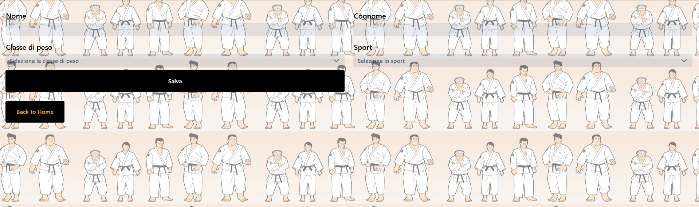
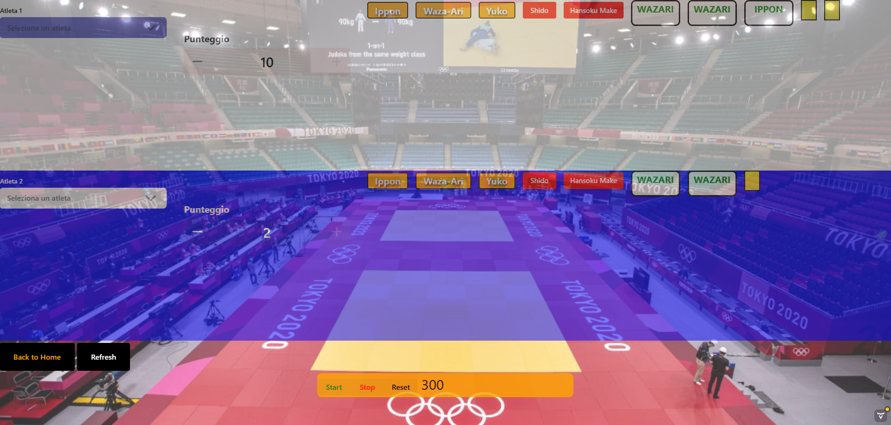
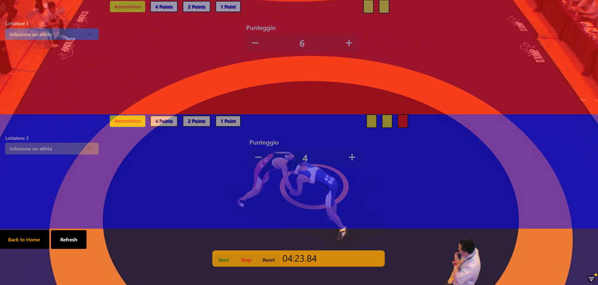

# Judo Wrestling Scoring Board

## Project Overview

* Judo Wrestling Scoring Board is a web application that allows users to register athletes for Judo and Wrestling competitions.
* It allows user to simulate a scoreboard for Judo and Wrestling competitions, including monition system and a timer.

## Features

* Two main boards, one for Judo and one for Wrestling competitions
* Register athletes through the registration page
* Scoring system, including monition system and a timer set to 5 minutes

## Technologies Used
* Java Spring Boot for the backend
* H2 as Database
* Vaadin for the frontend
* Countdown timer from a custom Vaadin component

## HOME PAGE

## REGISTRATION PAGE

## JUDO BOARD

## WRESTLING BOARD
